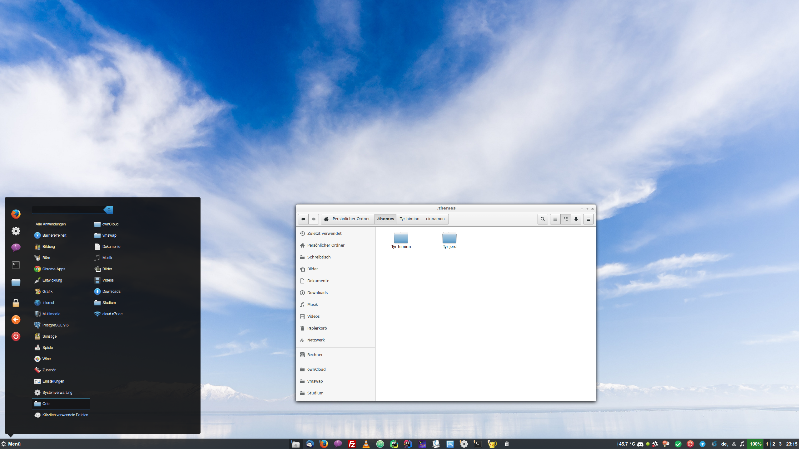

# My Cinnamon settings
This repository includes my Cinnamon settings. Included is the `.cinnamon` folder, the `.themes` folder as well as a `dconf` dump.
Spices and applets are listed via their UUID, so they can be easily found ad the Cinnamon spices database. This setup is used on a maching originally running Xubuntu 16.04. 



## Nautilus
- I switched my default file manager from Dolphin (the Xubuntu standard) to Nautilus. Based on your machine, this might already be the case. If not, there are several good tutorials available online on how to change the default file manager.

## Installed Applets
- temperature@fevimu
  - I like to monitor my CPU temperature from time to time.
- sound-with-apps-volume@koutch
  - Enables volume settings for each application currently running via Pulse
- batterymonitor@pdfcurtis 
  - This enables a functional battery percentage meter, since there is (or at least was) compatibility issues with my system.
- WindowListGroup@jake.phy@gmail.com 
  - I used MacOS for 6 years. Placing this Applet into the center of the main panel gives me back the workflow of the MacOS dock, while not looking as ugly and not taking up as much space.


## Theme
|Feature|Theme|
|-------|-----|
|Window Decorations|Greybird|
|Icons|elementary-xfce-dark|
|Cursor|DMZ black|

### Desktop Theme
- Tyr Himinn (slightly modified)


### dconf dump
All other settings (at least those I could find) are included in the file `cinnamon_settings.dconf`.
This file can be restored via the shell:

```bash
dconf load /org/cinnamon/ < cinnamon_settings.dconf
```

Make sure you restart your Cinnamon session after the import, otherwise Cinnamon might crash.
